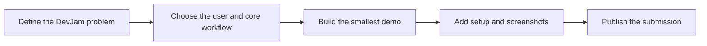

# Code Monkeys — DevJam

A lightweight home for the **Code Monkeys DevJam** project. This repository currently contains the project identity only; application code, setup commands, and releases have not been added yet.

> This README documents the repository as it exists today. It deliberately avoids claiming features that are not present in the codebase.

## Current state

| Area | Status |
| --- | --- |
| Project brief | Not yet included |
| Source code | Not yet included |
| Local setup | Not available |
| Tests and deployment | Not configured |

## Suggested project path

## Contributing

Start by opening an issue or adding a short project brief that answers:

1. What problem does the project solve?
2. Who is the intended user?
3. What should a DevJam judge be able to try?
4. Which stack and run commands does the implementation use?

Once source code lands, update this README with installation steps, a demo image, and the final submission link.
